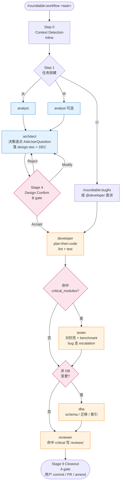

# roundtable

[English](./README.md) · [中文](./README-zh.md)

> **一张圆桌，把分析师、架构师、开发、测试、审查、DBA 请到同一个 Claude Code 会话里，用 plan-then-execute 的纪律逐步推进复杂需求。**

`roundtable` 是一个 [Claude Code](https://code.claude.com) plugin，把一套成熟的多角色 AI 开发工作流打包成"一行命令装完即用"的形态。

```bash
/plugin marketplace add duktig666/roundtable
/plugin install roundtable@roundtable --scope user
# 零弹窗，秒装完
```

或者本地 clone 直接用（改代码即刻生效，适合跟进未发版改动或自行魔改）：

```bash
git clone git@github.com:duktig666/roundtable.git
claude --plugin-dir /absolute/path/to/roundtable   # 在你的项目目录下执行
```

装完即可在任意项目里用：

```bash
/roundtable:workflow 设计 funding-rate 功能
/roundtable:bugfix 修复 Issue #123
/roundtable:lint
```

---

## 为什么叫 roundtable

> 亚瑟王的圆桌骑士制度有个精髓 —— **没有主位，每位骑士平等地围坐议事，用各自的专长共同做出决策**。

这个 plugin 做的正是这件事：

- **Analyst**（分析师）先把需求的痛点、竞品、失败模式、6 个月后评价想清楚
- **Architect**（架构师）拿 analyst 的产出做设计 —— 关键决策用 `AskUserQuestion` 弹窗让你逐个点选，不是单方面推方案
- **Developer**（开发）在架构确定后才动手，用 plan-then-execute 纪律先出实现计划再写代码
- **Tester**（测试）对关键模块做对抗性测试和 benchmark，不是应付式的单元测试
- **Reviewer / DBA**（代码 / 数据库审查）关键模块必过一眼

你不是听一个 Claude 自说自话，而是在主持一场圆桌讨论。

---

## 设计原则

1. **零配置安装** —— plugin.json 没有 `userConfig` 弹窗，运行时自动检测工具链（Cargo.toml / package.json / pyproject.toml / go.mod / Move.toml），项目业务规则通过各项目自己的 `CLAUDE.md` 自描述
2. **自动组织流程 + 文档化每阶段 I/O** —— 从 analyst → architect → developer → tester → reviewer / dba 全流程由 `/roundtable:workflow` 编排（自动识别任务规模 + 派发合适角色），每阶段输入 / 产出（`analyze/` → `design-docs/` → `exec-plans/` → `src/` + `tests/` → `testing/` → `reviews/`）都落盘可追溯；plan-then-execute 纪律贯穿 —— architect 出设计要用户确认再落盘，落盘后再写 exec-plan，developer / tester 中大任务先出实现 / 测试计划再动手
3. **决策逐点弹窗** —— architect 遇到关键决策点立即 `AskUserQuestion` 让用户点选，不堆砌成文字列表最后一次性问
4. **交互式 role 用 skill，自主执行 role 用 agent** —— architect / analyst 是 skill（主会话运行，`AskUserQuestion` 可用），developer / tester / reviewer / dba 是 agent（subagent 隔离上下文，避免主会话污染）
5. **文档三件套分层** —— 关键决策落 `decision-log.md`（append-only，Superseded 不删）、文档变更入 `log.md`（时间索引）、文件清单入 `INDEX.md`（产出分类导航）；参考 Karpathy LLM Wiki 的"Raw Source → Wiki → Schema"分层，让贡献者几分钟内 pin down 项目决策脉络
6. **Analyst 借鉴 gstack 六问检验** —— 需求不清时先走 analyst skill 的六问框架（为什么现在、失败模式、竞品做法、6 个月后评价、事实 vs 推论、交付对象），把模糊需求变成 architect 能接手的事实清单
7. **多项目原生支持** —— 根目录启动 Claude Code 时自动识别目标项目（git repo 扫描 + 任务描述正则匹配 + `AskUserQuestion` 兜底）

---

## 快速上手（5 分钟）

### 1. 安装 plugin

```bash
/plugin marketplace add duktig666/roundtable
/plugin install roundtable@roundtable --scope user
```

### 2. 在项目的 `CLAUDE.md` 里加配置 section

```markdown
# 多角色工作流配置

## critical_modules（tester / reviewer 必触发）
- <你项目里"改错了会出大事"的关键模块>

## 设计参考
- <你的项目对标什么产品、参考什么框架>

## 工具链覆盖（可选，默认走自动检测）
- lint: <你项目的 lint 命令>
- test: <你项目的 test 命令>

## 条件触发规则（可选）
- <涉及 X → 必须 Y 的业务规则>
```

完整模板见 [`docs/claude-md-template.md`](docs/claude-md-template.md)（P3 阶段产出）。

### 3. 跑起来

```bash
# 在项目内或根目录 workspace 都行
claude
> /roundtable:workflow 设计一个 XXX 功能

# roundtable 会：
#  1. 识别目标项目（根目录启动时自动扫 .git/ 子目录 + 匹配任务描述 → AskUserQuestion 兜底）
#  2. 检测技术栈（读 Cargo.toml / package.json 等）
#  3. 加载你项目的 CLAUDE.md 业务规则
#  4. 激活 architect skill，决策点逐个 AskUserQuestion 弹窗让你点选
#  5. 落盘 design-doc → 你审阅 → 派发 developer agent 写代码 → tester agent 跑测试 → reviewer agent 审查
```

---

## 使用：命令 / Skill / Agent

roundtable 共提供 **3 个命令**、**2 个 skill**、**5 个 agent**。命令是入口；skill 是可直接调用的交互式角色；agent 是由编排器派发的隔离 subagent（你也可以用 `@mention` 直接点名）。

### 命令（入口）

| 命令 | 用途 | 什么时候调 |
|------|------|------------|
| `/roundtable:workflow <任务>` | 总编排器 —— 自动识别任务规模（小 / 中 / 大），派发对应角色 | 任何非琐碎的功能、重构、调研的默认入口 |
| `/roundtable:bugfix <issue>` | Bug 工作流 —— 跳过设计阶段，直接 developer → 按需 tester/reviewer/dba，强制带回归测试 | 清晰、定位明确的 Bug；你大致知道它在哪 |
| `/roundtable:lint` | 文档健康检查 —— 扫描决策漂移、陈旧 exec-plan、孤儿文件、断链、事实 / 推论混淆。**只出报告，不改文件** | 文档高变更的一周后、发版前、或 `design-docs/` / `decision-log.md` 感觉脱节时 |

### Skill（主会话 / 交互式 —— `AskUserQuestion` 可用）

调用方式：`@roundtable:<name>` 或让 `/roundtable:workflow` 自动激活。

| Skill | 做什么 | 典型触发 |
|-------|--------|----------|
| `@roundtable:analyst` | 技术调研、竞品分析、可行性评估；跑六问框架分离事实与推论 | 需求模糊，架构师接手前需要一份事实清单 |
| `@roundtable:architect` | 三阶段：决策弹窗（`AskUserQuestion`）→ 落盘 `design-docs/<slug>.md` + `decision-log.md` DEC → 按需 `exec-plans/` | 新功能或重大重构；希望每个 trade-off 在落盘前都被点出来 |

### Agent（subagent 隔离 / 自主执行）

Agent 在全新上下文中运行；一般由编排器派发，但你也可以 `@mention` 直接调用做一次性任务。

| Agent | 做什么 | 什么时候自动触发 |
|-------|--------|--------------------|
| `@roundtable:developer` | plan-then-code、TDD，支持任意语言 / 技术栈（Rust / TS / Python / Go / Move / …），工具链从项目根自动检测 | 设计确认后，或任何小型编码任务 |
| `@roundtable:tester` | 对抗性测试、E2E 场景、性能 benchmark；**只写测试代码，不动业务代码** | `critical_modules` 命中或性能敏感路径 |
| `@roundtable:reviewer` | 只读代码审查：质量、安全、性能、设计一致性、测试覆盖 | 关键模块或合入大改动前 |
| `@roundtable:dba` | 只读数据库审查：schema、查询优化、迁移安全、索引策略 | diff 涉 DB schema / migrations / 热路径查询 |
| `@roundtable:research` | 短生命周期 worker，由 architect skill 派发，针对**单一备选方案**做深度事实层调研；返回结构化 `<research-result>` JSON | architect 专属派发 —— 不是用户入口 |

### 直接调用示例

```bash
# 让编排器选路径
/roundtable:workflow 新增 WebSocket 行情推送

# 只跑调研 —— 不出设计也不动代码
@roundtable:analyst 对比 QuickFIX 和自研 FIX parser 在我们 OMS 的取舍

# 只出设计 —— 设计文档 + 决策日志，不实现
@roundtable:architect 为亚毫秒级延迟重新设计撮合引擎

# 跳过设计，直接改代码
/roundtable:bugfix Issue #42: 订单簿重启后漂移

# 不跑整套 workflow，单独拉一次 review
@roundtable:reviewer 审计 auth/middleware.rs 里的 session token 存储

# 仅对迁移做数据库审查
@roundtable:dba 检查 migration 0042 在 5000 万行表上是否安全
```

---

## Phase Matrix 机制

`/roundtable:workflow` 全程维护一张 **9 阶段状态表**，每次 phase 切换或用户问进度时即时报告，让编排状态始终可视。

| 阶段 | 主角 | 产出 | Gate |
|-----|------|------|------|
| 1. Context detection | inline | `target_project` / `docs_root` / 工具链 / `critical_modules` | C |
| 2. Research（可选） | analyst | `analyze/[slug].md` | A |
| 3. Design | architect | `design-docs/[slug].md` + `decision-log.md` DEC | A |
| 4. Design confirmation | 用户 | Accept / Modify / Reject | B |
| 5. Implementation | developer | `src/` + `tests/`、exec-plan checkbox | C |
| 6. Adversarial testing | tester | 测试代码 + `testing/[slug].md` | C |
| 7. Review | reviewer | 对话 或 `reviews/[date]-[slug].md` | C |
| 8. DB review | dba | 对话 或 `reviews/[date]-db-[slug].md` | C |
| 9. Closeout | 用户 | 汇总 findings；用户驱动 commit / PR | A |

**状态图例**：⏳ 待办 · 🔄 进行中 · ✅ 完成 · ⏩ skipped

**Gate 分类（DEC-006）决定 phase transition 节奏**：

- **A producer-pause** —— 阶段以用户可消费产物结尾；orchestrator 给 3 行 summary 后**停手不调工具**，等用户 `go` / `调范围: ...` / 问题
- **B approval-gate** —— 方向性锁（仅 Stage 4）；按 Option Schema 调 `AskUserQuestion`，每选项含 `rationale` + `tradeoff` + 可选 `★recommended`
- **C verification-chain** —— 内部交接自动推进，emit 一行 `🔄 X 完成 → dispatching Y`；`critical_modules` 命中 / `<escalation>` / lint+test 失败立即打断走 escalation

产出类（Step 7 INDEX / Step 8 log.md）由 orchestrator 在 **A 转场 + C 过桥 + Stage 9 终点**批量 flush，角色绝不自写共享索引。

---

## workflow 流程图



**跨阶段关键编排**：

- **Step 3.5 Progress Monitor**（DEC-004 / DEC-008）—— 每个 `run_in_background: true` 的 `Task` 配独立 Monitor 流，前台派发跳过（子 agent 输出已实时缩进回显）
- **Step 4 并行判定** —— PREREQ MET / PATH DISJOINT / SUCCESS-SIGNAL INDEPENDENT / RESOURCE SAFE **四条全中**且加速 >30% 才并行，否则串行
- **Step 5 Escalation** —— agent final report 的 `<escalation>` JSON block → orchestrator 调 `AskUserQuestion` 给用户 → 决策注入 prompt 重派同一 agent（scope 限 `remaining_work`）
- **Step 6b Developer 形态**（DEC-005）—— per-session `@...inline` > per-project `developer_form_default` > per-dispatch 弹窗；tester / reviewer / dba 永远 subagent
- **Step 7 / 8 批量 flush** —— `INDEX.md` 与 `log.md` 由 orchestrator 聚合 flush，触发点：A 转场 / C 过桥 / Stage 9 终点

---

## 延伸阅读

- 英文版：[README.md](./README.md)
- 架构决策：[`docs/decision-log.md`](docs/decision-log.md)
- Plan-then-execute 规范：[`docs/exec-plans/active/roundtable-plan.md`](docs/exec-plans/active/roundtable-plan.md)
- 目标项目 `CLAUDE.md` 模板：[`docs/claude-md-template.md`](docs/claude-md-template.md)
- Changelog：[`CHANGELOG.md`](CHANGELOG.md)
- 贡献指南：[`CONTRIBUTING.md`](CONTRIBUTING.md)
