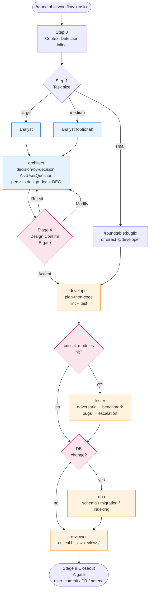

# roundtable

[English](./README.md) · [中文](./README-zh.md)

> **Sit the analyst, architect, developer, tester, reviewer, and DBA at the same Claude Code session, and push complex work forward with plan-then-execute discipline.**

`roundtable` is a [Claude Code](https://code.claude.com) plugin that packages a battle-tested multi-role AI development workflow into a one-line install.

```bash
/plugin marketplace add duktig666/roundtable
/plugin install roundtable@roundtable --scope user
# zero prompts, installs in seconds
```

Or clone locally (edits take effect immediately — good for tracking unreleased changes or hacking on it yourself):

```bash
git clone git@github.com:duktig666/roundtable.git
claude --plugin-dir /absolute/path/to/roundtable   # run in your project directory
```

Once installed, use it in any project:

```bash
/roundtable:workflow design the funding-rate feature
/roundtable:bugfix fix Issue #123
/roundtable:lint
```

---

## Why "roundtable"

> The Knights of the Round Table had one rule — **no head seat; every knight sits as an equal and brings their expertise to a shared decision.**

That's what this plugin does:

- **Analyst** first thinks through the pain point, competitive landscape, failure modes, and the "six-months-from-now" evaluation
- **Architect** takes the analyst's output and designs — every key decision is surfaced via `AskUserQuestion` for you to pick, not pushed unilaterally
- **Developer** only touches code after architecture is locked; uses plan-then-execute discipline (implementation plan first, code second)
- **Tester** writes adversarial tests and benchmarks for critical modules, not token unit tests
- **Reviewer / DBA** (code / database reviewers) always take a pass on critical modules

You're not listening to one Claude monologue — you're chairing a roundtable.

---

## Design Principles

1. **Zero-config install** — `plugin.json` has no `userConfig` prompts; toolchain is detected at runtime (`Cargo.toml` / `package.json` / `pyproject.toml` / `go.mod` / `Move.toml`); project-specific business rules live in each project's own `CLAUDE.md`
2. **Auto-orchestrated flow + documented stage I/O** — `/roundtable:workflow` runs the full analyst → architect → developer → tester → reviewer / dba chain (auto-sizes the task and dispatches matching roles); every stage's input/output (`analyze/` → `design-docs/` → `exec-plans/` → `src/` + `tests/` → `testing/` → `reviews/`) is persisted and auditable; plan-then-execute runs end-to-end — architect gets user sign-off before persisting the design doc, then writes the exec-plan; developer/tester produce an implementation/test plan for medium-large tasks before touching code
3. **Decision-by-decision popups** — when the architect hits a key decision, it fires `AskUserQuestion` immediately for you to pick, instead of piling up a text list to ask at the end
4. **Interactive roles → skills, autonomous roles → agents** — architect / analyst are skills (run in the main session, `AskUserQuestion` available); developer / tester / reviewer / dba are agents (subagent-isolated context, main session stays clean)
5. **Three-tier doc structure** — key decisions go in `decision-log.md` (append-only; Superseded entries are not deleted), doc mutations go in `log.md` (time-indexed), file inventory goes in `INDEX.md` (navigation by category); borrows Karpathy's LLM Wiki layering ("Raw Source → Wiki → Schema") so contributors can pin down project decisions in minutes
6. **Analyst borrows gstack's six-question check** — when requirements are fuzzy, the analyst skill's six-question framework (why now / failure modes / how competitors do it / six-months-from-now evaluation / fact vs inference / who receives the delivery) turns vague asks into a fact sheet the architect can pick up
7. **First-class multi-project support** — when you start Claude Code from a workspace root, the plugin identifies the target project (git repo scan + regex match on task description + `AskUserQuestion` fallback)

---

## Quick Start (5 minutes)

### 1. Install the plugin

```bash
/plugin marketplace add duktig666/roundtable
/plugin install roundtable@roundtable --scope user
```

### 2. Add a config section to your project's `CLAUDE.md`

```markdown
# Multi-role workflow config

## critical_modules (must trigger tester / reviewer)
- <modules in your project where a bug would cause real damage>

## Design references
- <what product your project targets; what frameworks you borrow from>

## Toolchain overrides (optional; auto-detection is default)
- lint: <your lint command>
- test: <your test command>

## Conditional trigger rules (optional)
- <business rules like "touching X → must Y">
```

Full template at [`docs/claude-md-template.md`](docs/claude-md-template.md) (P3 output).

### Decision mode (modal | text)

Decisions normally surface via `AskUserQuestion` modal popup (works in Claude Code main session). For remote frontends where the modal cannot be answered (Telegram, CI, log replay), switch to **text mode** — decisions emit as `<decision-needed>` blocks into the chat stream; reply with free text (`A` / `选 A` / `go with B but tweak X`). See [DEC-013](docs/decision-log.md) / [design-doc](docs/design-docs/decision-mode-switch.md).

| Priority | Source | Example |
|----------|--------|---------|
| 1 | CLI arg | `/roundtable:workflow --decision=text ...` |
| 2 | Env var | `ROUNDTABLE_DECISION_MODE=text` (or via `.claude/settings.json` `env` block — Claude Code merges local > project > user automatically) |
| 3 | Default | `modal` |

### 3. Run it

```bash
# from inside the project, or from a workspace root
claude
> /roundtable:workflow design an XXX feature

# roundtable will:
#  1. Identify the target project (scans .git/ subdirs, matches task description, falls back to AskUserQuestion)
#  2. Detect the toolchain (reads Cargo.toml / package.json / etc.)
#  3. Load your project's CLAUDE.md business rules
#  4. Activate the architect skill; each decision point fires AskUserQuestion for you
#  5. Persist the design-doc → you review → dispatch developer → tester → reviewer
```

---

## The Orchestrator

The **orchestrator** is the **main-session Claude** running `/roundtable:workflow` or `/roundtable:bugfix` — not a separate agent or process. It executes `commands/workflow.md`'s orchestration logic: it never designs, codes, or reviews itself; it only dispatches, gates, and aggregates.

### Dispatch mechanisms

| Role form | Dispatched via | Runs in |
|-----------|---------------|---------|
| **skill** (analyst, architect) | `Skill` tool | main session (shares context with orchestrator) |
| **subagent** (tester, reviewer, dba, research) | `Task` tool | isolated subagent context |
| **inline developer** (DEC-005 escape hatch) | orchestrator `Read`s `agents/developer.md` and acts in-line | main session |

### Privileges (roles do NOT have these)

- **Sole writer** of `docs/INDEX.md` / `docs/log.md` / `exec-plans/[slug]-plan.md` checkboxes — roles report `log_entries:` YAML / `created:` paths; orchestrator writes on their behalf to avoid races on shared artifacts
- **Sole `AskUserQuestion` relayer** for subagent `<escalation>` JSON blocks — subagents can't pop dialogs themselves
- **Sole git actor** — only runs `commit` / `push` / `branch` / `tag` / `reset` / `stash` when the user explicitly asks

### What the orchestrator does, stage by stage

- **Step 0** context detection — `target_project` / `docs_root` / toolchain / CLAUDE.md `critical_modules`
- **Step 1** task sizing — small / medium / large → pipeline selection
- **Step 3.4** dispatch mode selection — per-session `@role bg|fg` → parallelism → `AskUserQuestion`
- **Step 3.5** Progress Monitor setup — background dispatches only (DEC-008 gate)
- **Step 4** parallel-dispatch decision tree — PREREQ MET / PATH DISJOINT / SUCCESS-SIGNAL INDEPENDENT / RESOURCE SAFE
- **Step 5** parse `<escalation>` → relay via `AskUserQuestion` → re-dispatch with user's decision
- **Step 6** phase gating — A producer-pause / B approval-gate / C verification-chain (DEC-006)
- **Step 7/8** batch-flush `INDEX.md` / `log.md` at A-transitions, C bridges, and the Stage 9 endpoint

**Analogy — the PM in a meeting room**: skills are subject-matter experts in the main room (shared whiteboard); subagents are outside review teams in their own rooms (only final memos come back); the orchestrator is the PM — scheduling who's in the room, keeping minutes, and talking to the client (user).

---

## Usage: Commands, Skills, Agents

roundtable ships **3 commands**, **2 skills**, and **5 agents**. Commands are the entry points; skills are interactive roles you can invoke directly; agents are isolated subagents that the orchestrator dispatches (though you can `@mention` them directly too).

### Commands (entry points)

| Command | Purpose | When to call |
|--------|---------|---------|
| `/roundtable:workflow <task>` | Full orchestrator — auto-sizes the task (small / medium / large) and dispatches roles | Default entry for any non-trivial feature, refactor, or investigation |
| `/roundtable:bugfix <issue>` | Bug workflow — skips design, goes developer → optional tester/reviewer/dba with a mandatory regression test | Clear, localized bug; you already know roughly where it lives |
| `/roundtable:lint` | Docs health check — scans for decision drift, stale exec-plans, orphan files, broken links, fact-vs-inference confusion. **Reports only, does not modify files** | After a busy week of doc churn, before a release, or when `design-docs/` / `decision-log.md` feel out of sync |

### Skills (main-session, interactive — `AskUserQuestion` available)

Invoke a skill with `@roundtable:<name>` or rely on `/roundtable:workflow` to activate it.

| Skill | What it does | Typical trigger |
|-------|--------------|-----------------|
| `@roundtable:analyst` | Research, competitive analysis, feasibility assessment; runs the six-question framework to separate fact from inference | Requirements are fuzzy; you need a fact sheet before architecture |
| `@roundtable:architect` | Three-phase: decision popups (`AskUserQuestion`) → persist `design-docs/<slug>.md` + `decision-log.md` DEC → optional `exec-plans/` | New feature or major refactor; you want each trade-off surfaced before the doc is written |

### Agents (subagent-isolated, autonomous execution)

Agents run in a fresh context; the orchestrator dispatches them, but you can also `@mention` them directly for one-off tasks.

| Agent | What it does | When it's auto-invoked |
|-------|--------------|------------------------|
| `@roundtable:developer` | plan-then-code, TDD, any language/stack (Rust / TS / Python / Go / Move / …); tooling detected from project root | After design sign-off, or any small coding task |
| `@roundtable:tester` | Adversarial tests, E2E scenarios, performance benchmarks; writes test code only, never business code | Any module listed in `critical_modules`, or performance-sensitive paths |
| `@roundtable:reviewer` | Read-only code review: quality, security, performance, design consistency, test coverage | Critical modules or before merging large changes |
| `@roundtable:dba` | Read-only DB review: schema, query optimization, migration safety, indexing | When the diff touches DB schema, migrations, or hot queries |
| `@roundtable:research` | Short-lived worker dispatched by the architect skill to gather facts on **one** architectural option; returns a structured `<research-result>` JSON block | Architect-dispatched only — not a user-facing entry point |

### Direct invocation examples

```bash
# Let the orchestrator pick the path
/roundtable:workflow add a WebSocket market-data feed

# Research-only — no design, no code
@roundtable:analyst compare QuickFIX vs a hand-rolled FIX parser for our OMS

# Design-only — get a design-doc and decision log without implementation
@roundtable:architect redesign the order-matching engine for sub-millisecond latency

# Skip design, jump straight to code
/roundtable:bugfix Issue #42: order book drifts after restart

# Parallel one-off review without running the full workflow
@roundtable:reviewer audit the session-token storage in auth/middleware.rs

# Database-only check on a migration
@roundtable:dba verify migration 0042 is safe on a 50M-row table
```

---

## Phase Matrix

`/roundtable:workflow` keeps a **9-stage status table** live at all times and reports it on every phase transition or progress query, so orchestration state is always visible.

| Stage | Owner | Output | Gate |
|-------|-------|--------|------|
| 1. Context detection | inline | `target_project` / `docs_root` / toolchain / `critical_modules` | C |
| 2. Research (optional) | analyst | `analyze/[slug].md` | A |
| 3. Design | architect | `design-docs/[slug].md` + `decision-log.md` DEC | A |
| 4. Design confirmation | user | Accept / Modify / Reject | B |
| 5. Implementation | developer | `src/` + `tests/`, exec-plan checkbox | C |
| 6. Adversarial testing | tester | test code + `testing/[slug].md` | C |
| 7. Review | reviewer | conversation or `reviews/[date]-[slug].md` | C |
| 8. DB review | dba | conversation or `reviews/[date]-db-[slug].md` | C |
| 9. Closeout | user | rollup of findings; user-driven commit / PR | A |

**Status legend**: ⏳ pending · 🔄 in progress · ✅ done · ⏩ skipped

**Gate taxonomy (DEC-006) drives phase-transition cadence**:

- **A — producer-pause** — the stage ends with a user-consumable artifact; orchestrator gives a 3-line summary then **stops calling tools**, waiting for `go` / `scope: ...` / questions
- **B — approval-gate** — directional lock (Stage 4 only); `AskUserQuestion` fires with the Option Schema — each option has `rationale` + `tradeoff` + optional `★recommended`
- **C — verification-chain** — internal handoffs auto-advance; one line emitted: `🔄 X done → dispatching Y`; a hit on `critical_modules` / an `<escalation>` block / a lint+test failure interrupts and walks escalation

Output-class operations (Step 7 `INDEX` / Step 8 `log.md`) are **batch-flushed by the orchestrator** at A-transitions + C bridges + the Stage 9 endpoint; roles never write shared indexes themselves.

---

## Workflow Graph



**Cross-stage orchestration highlights**:

- **Step 3.5 Progress Monitor** (DEC-004 / DEC-008) — every `run_in_background: true` `Task` gets its own Monitor stream; foreground dispatches skip it (subagent output is already live-indented in the transcript)
- **Step 4 parallel eligibility** — parallelize only when PREREQ MET / PATH DISJOINT / SUCCESS-SIGNAL INDEPENDENT / RESOURCE SAFE **all four hold** and the speedup is >30%; otherwise serial
- **Step 5 Escalation** — the agent's final `<escalation>` JSON block → orchestrator fires `AskUserQuestion` → decision is injected into a fresh prompt and the same agent is re-dispatched (scope clamped to `remaining_work`)
- **Step 6b Developer execution form** (DEC-005) — per-session `@…inline` > per-project `developer_form_default` > per-dispatch popup; tester / reviewer / dba are always subagents
- **Step 7 / 8 batch flush** — `INDEX.md` and `log.md` are aggregated and flushed by the orchestrator; triggers: A-transition / C bridge / Stage 9 endpoint

---

## Further Reading

- Chinese version: [README-zh.md](./README-zh.md)
- Architecture decisions: [`docs/decision-log.md`](docs/decision-log.md)
- Plan-then-execute spec: [`docs/exec-plans/active/roundtable-plan.md`](docs/exec-plans/active/roundtable-plan.md)
- `CLAUDE.md` template for target projects: [`docs/claude-md-template.md`](docs/claude-md-template.md)
- Changelog: [`CHANGELOG.md`](CHANGELOG.md)
- Contributing: [`CONTRIBUTING.md`](CONTRIBUTING.md)
